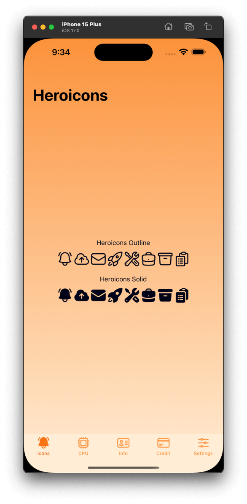

# Example App with Heroicons

This is an example app created to showcase the seamless integration of Heroicons into a mobile application developed with Titanium SDK. Heroicons, designed by Tailwind Labs, are known for their beautiful and simple design, making them an excellent addition to your mobile app.

## Overview

The example app features a TabGroup with multiple tabs, with the primary focus on the "Icons Tab." In this tab, we demonstrate how to use Heroicons in your mobile app. Here's what you'll find:

- Showcases the usage of Heroicons in both outline and solid styles.
- Displays a variety of Heroicons, demonstrating their versatility and adaptability for your app's user interface.
- The `TabGroup` showcases the potential use of TiKit UI's `Tab` Component and Icon Fonts for a cross-platform app, eliminating the need to create separate images with different resolutions, colors, and densities.

  

## Usage

To run this example app and explore the usage of Heroicons in a Titanium-based mobile application:

1. Ensure you have the [Titanium SDK](https://titaniumsdk.com/guide/Titanium_SDK/Titanium_SDK_Getting_Started/) and [PurgeTSS](https://purgetss.com/docs/installation) set up in your development environment.

2. Clone or download this repository to your local machine.

3. Open the app in your favorite code editor.

4. Run the app to see how Heroicons can be seamlessly incorporated into your mobile app's user interface.

Feel free to customize, enhance, or adapt the example app to effectively use Heroicons in your own Titanium-based mobile applications.

## Credits

- [Titanium SDK](https://titaniumsdk.com) for cross-platform mobile app development.
- [PurgeTSS](#)  A package that helps Titanium developers create visually appealing mobile apps.
- [Heroicons](https://heroicons.com) by Tailwind Labs for providing beautiful SVG icons, the primary focus of this example app.

Please ensure you respect the licensing and usage guidelines of the respective tools and components used in this example app.

---

*A Titanium SDK Example App created for educational purposes with a primary focus on showcasing Heroicons.*
