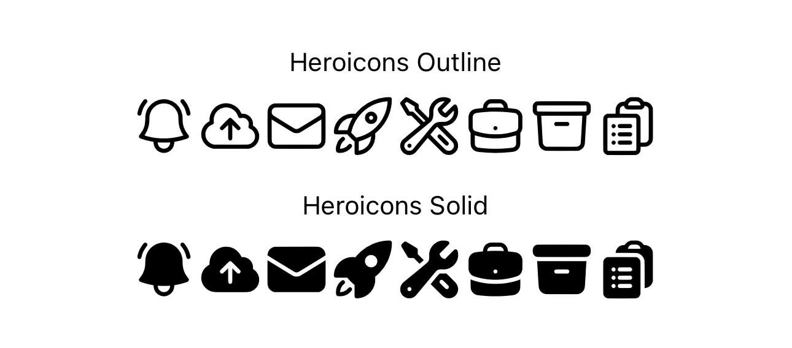

# Heroicons Font Files

<p align="center">
  <a href="https://heroicons.com/" target="_blank">
    
  </a>
</p>

These font files contain hand-crafted SVG icons from [heroicons.com](https://heroicons.com), created by the talented team at [Tailwind Labs](https://github.com/tailwindlabs), the creators of [Tailwind CSS](https://tailwindcss.com).

Heroicons are renowned for their beautiful and minimalist design, and they are widely used in web applications, particularly within the Tailwind CSS ecosystem.

## Project Overview

This project provides TrueType format font files that enable seamless integration of Heroicons into your cross-platform mobile apps using [Titanium SDK](https://titaniumsdk.com) and [PurgeTSS](https://purgetss.com). These font files were generated using the [IcoMoon](https://icomoon.io/) tool.

By using these font files, you can effortlessly incorporate Heroicons into your app's user interface.

## Usage

To use Heroicons in your Titanium SDK-based mobile app with PurgeTSS, follow these steps:

First, make sure you have **PurgeTSS** installed globally on your machine:

```bash
> npm i -g purgetss
```

1. Download the `heroicons.zip` folder from this repository.
2. Extract it into your project's `./purgetss/fonts/` folder.
3. Run `purgetss build-fonts`.
   - This command will create the `./purgetss/styles/fonts.tss` file with all class definitions and `fontFamily` selectors:
      ```scss
      '.hio': { font: { fontFamily: 'heroicons-outline' } }`
      '.his': { font: { fontFamily: 'heroicons-solid' } }`
      ```
   - It will also copy the font files into the `./app/assets/fonts` folder, for cross-platform compatibility.

Now, you can use them in your app's user interface elements, including `Labels`, `Buttons`, `TextFields` and `Tabs` (using [TiKit UI](https://purgetss.com/tikit#tabs)'s Tab Component).

```xml
<Alloy>
  <Window class="container">
    <View class="vertical">
      <Label class="text-sm" text="Heroicons Outline" />
      <View class="mt-2 horizontal">
        <Label class="text-4xl hio hio-bell-alert" />
        <Label class="text-4xl hio hio-cloud-arrow-up" />
        <Label class="text-4xl hio hio-envelope" />
        <Label class="text-4xl hio hio-rocket-launch" />
        <Label class="text-4xl hio hio-wrench-screwdriver" />
        <Label class="text-4xl hio hio-briefcase" />
        <Label class="text-4xl hio hio-archive-box" />
        <Label class="text-4xl hio hio-clipboard-document-list" />
      </View>

      <Label class="text-sm mt-4" text="Heroicons Solid" />
      <View class="horizontal mt-2">
        <Label class="text-4xl his his-bell-alert" />
        <Label class="text-4xl his his-cloud-arrow-up" />
        <Label class="text-4xl his his-envelope" />
        <Label class="text-4xl his his-rocket-launch" />
        <Label class="text-4xl his his-wrench-screwdriver" />
        <Label class="text-4xl his his-briefcase" />
        <Label class="text-4xl his his-archive-box" />
        <Label class="text-4xl his his-clipboard-document-list" />
      </View>
    </View>
  </Window>
</Alloy>
```

<p align="center">
  
</p>

Remember to credit **Tailwind Labs** for their fantastic work on the Heroicons collection, as all intellectual properties and design credits belong to them. This project simply aims to facilitate the integration of these icons into mobile applications, respecting their intellectual property rights.

## Example App
Download the Example App `heroicons-app.zip`, created to showcase the seamless integration of Heroicons into a mobile application developed with Titanium SDK, PurgeTSS and TiKit UI Components. [Read More](./heroicons-app/README.md).

## License

Please note that Heroicons is a product of Tailwind Labs and is subject to its licensing terms. Before using these icons in your project, make sure to review and comply with Tailwind Labs' licensing and usage guidelines.

For detailed information about Heroicons, you can visit their official website: [heroicons.com](https://heroicons.com/)

## Disclaimer

This project is not affiliated with or endorsed by Tailwind Labs. It's created solely for the purpose of making these icons more accessible for Cross Platform Mobile App development with Titanium SDK and PurgeTSS.

---

*All intellectual properties and design credits for Heroicons belong to Tailwind Labs.*
